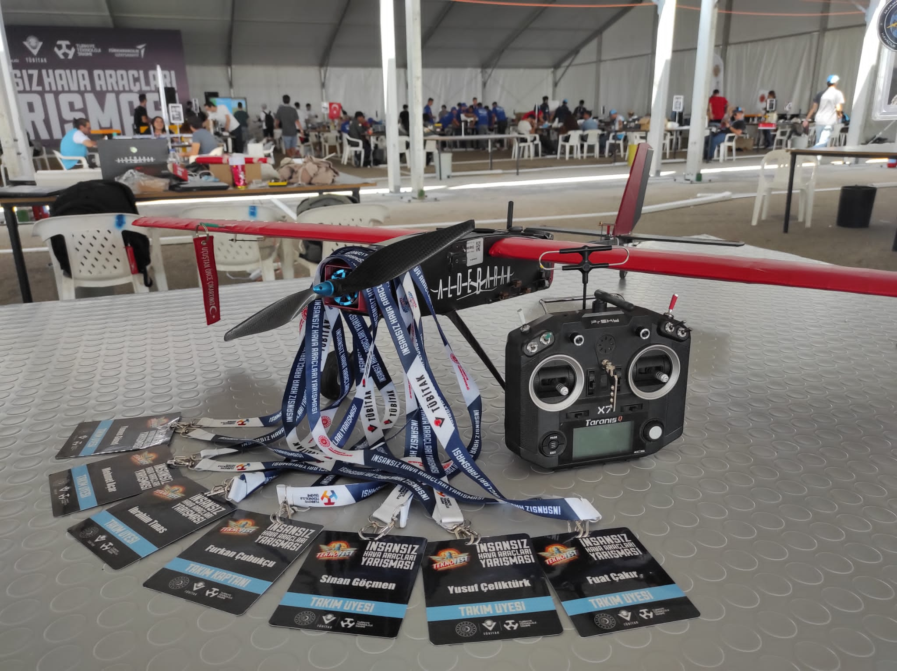
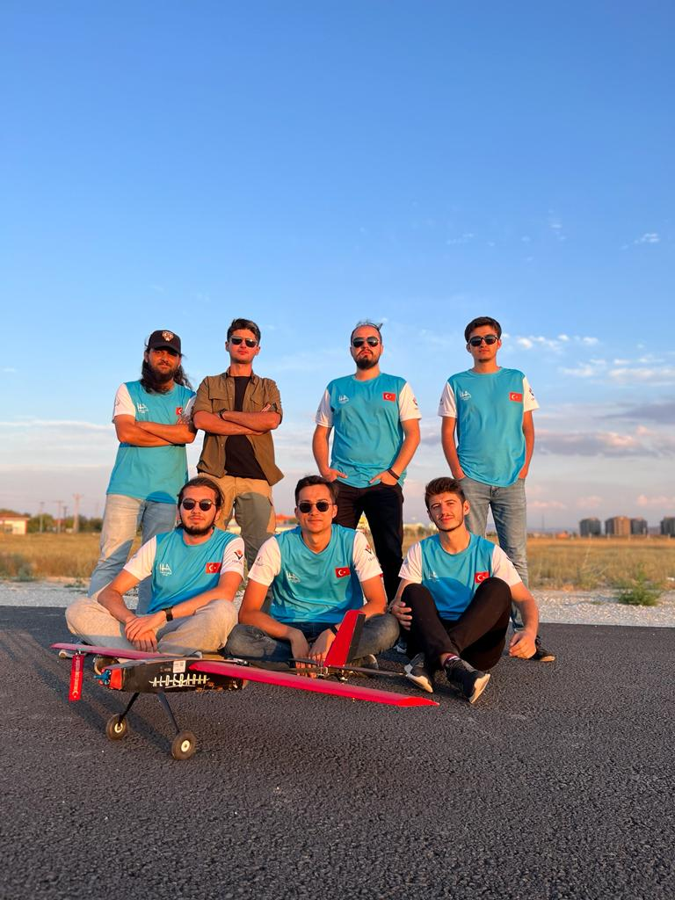

  
  

# Fixed-Wing UAV Target Detection and Load Release

This repository contains the code and documentation for the **Fixed-Wing UAV Target Detection and Load Release** project, which was developed for the 2022 TEKNOFEST International UAV Competition. Our autonomous fixed-wing UAV, named "Aldebaran-22," successfully participated in the finals, achieving 8th place among over 300 teams.

The primary objective of this project is to autonomously detect a 2.5-meter-diameter red circle on the ground and accurately release two baseballs onto the target area during subsequent flight passes. The UAV accomplishes this using real-time image processing and GPS telemetry data to calculate the optimal release point.

## Features
- **Real-time Image Processing**: Utilizes OpenCV for detecting the red circle on the ground.
- **Precise Load Release**: Computes the UAV's speed, altitude, and position to determine the ideal release point for the payload.
- **Autonomous Operation**: The UAV autonomously navigates the target area, performs target detection, and releases the payload without human intervention.
- **Simulation and Real-World Execution**: Includes code for both simulation environments and real-world UAV hardware.

## Hardware and Software
- **Hardware**: Raspberry Pi Model 4B, Raspberry Pi Camera Module v2.1, and Pixhawk Cube Orange Flight Control Card.
- **Software**: MavSDK for UAV control, OpenCV for image processing, and Haversine for distance calculation.

## Documentation
For a detailed explanation of the mission and algorithm, refer to `method.pdf` included in this repository.
